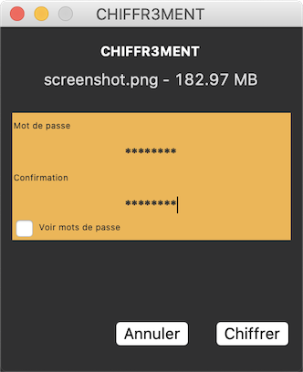

# chiffr3ment

**Projet:** Application de chiffrement AES256 de fichiers.

## Développement
- Python > 3.6
- Tkinter (GUI)

## Modules externes (pip install)
- cryptography==2.8

## Plateforme
- Windows
- MacOS (testé sur Catalina)
- Linux

## Auteurs
- Vincent Houillon
- Quentin Houillon

## Licence
n/a
